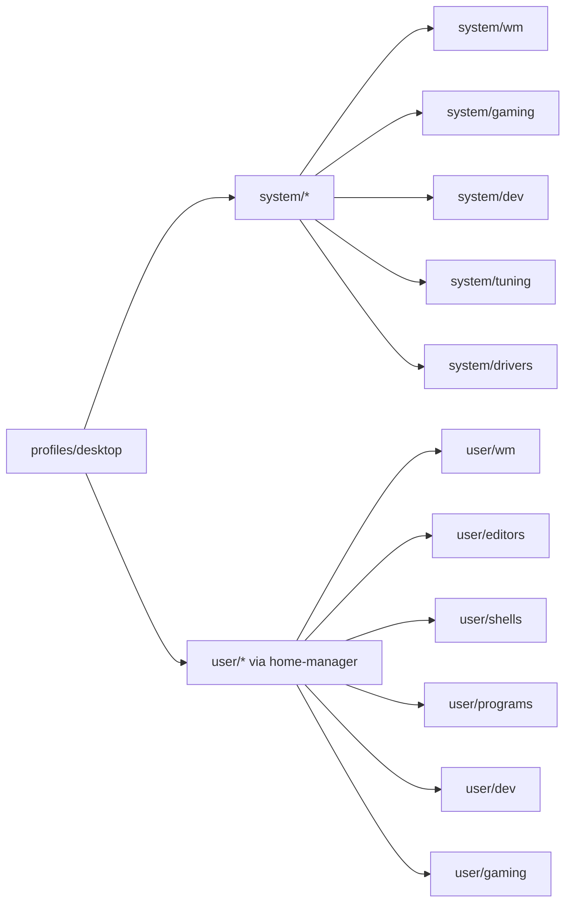
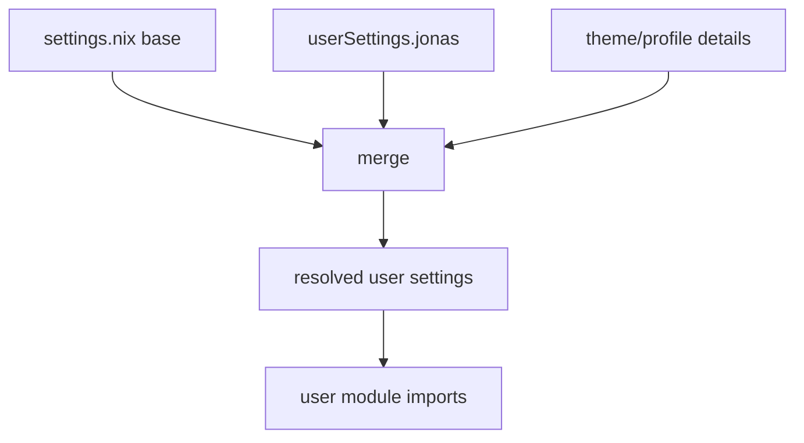
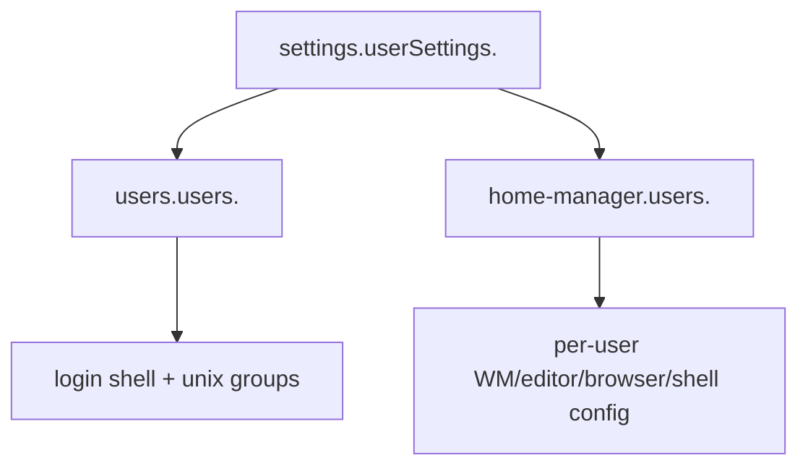
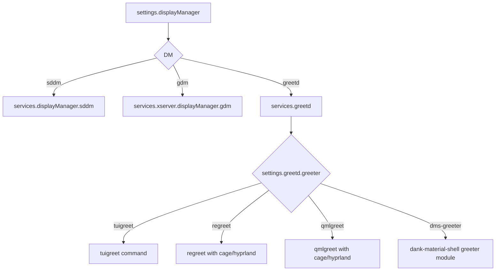
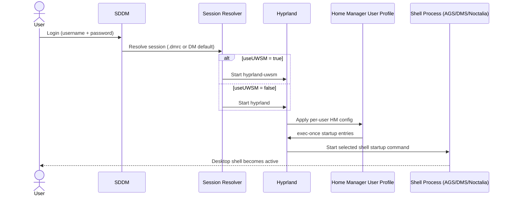
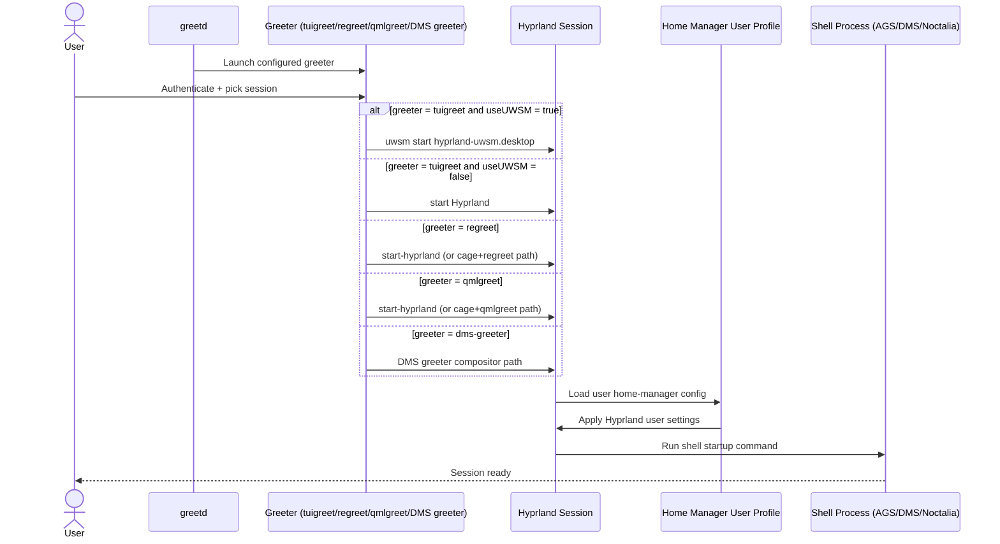
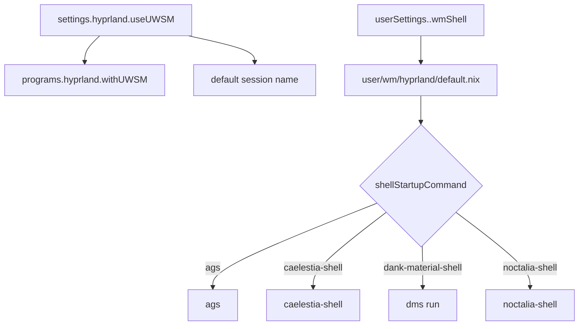
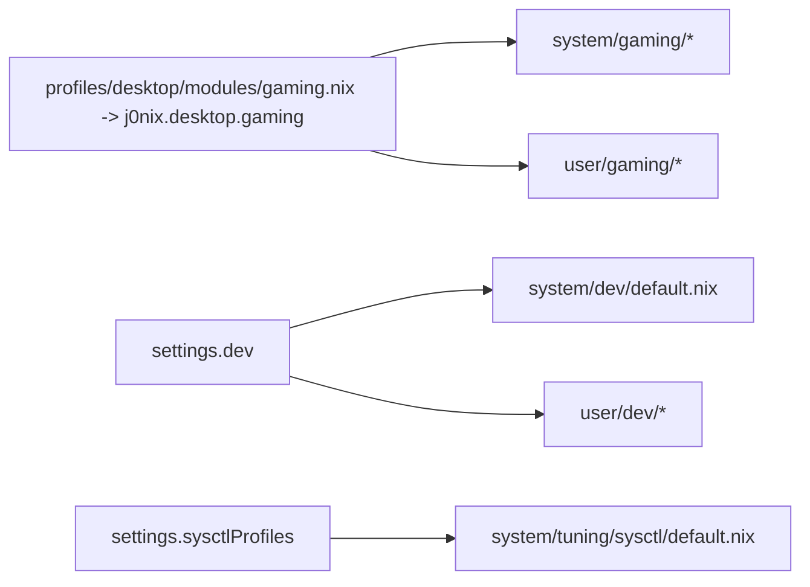
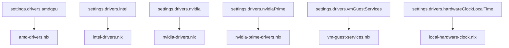

# j0nix-os Architecture

This document describes how `j0nix-os` is structured, how settings flow through the flake, and how runtime session selection works.

Related deep dives:

- [QMLGreet Integration](./wm/qmlgreet.md)

## Design Goals

- Independent codebase (no local imports from sibling reference projects)
- Strong module boundaries (`profiles`, `system`, `user`)
- Multi-user by default with per-user overrides
- Hyprland-first but desktop-manager/session flexible
- Gaming and development as composable feature stacks

## High-Level Build Graph

```mermaid
flowchart TD
  A[settings.nix] --> B[flake.nix]
  B --> |mkNixosSystem<br>{ profileName = "desktop"; hostname = "Jonas-PC"; }| C[nixosSystem profiles/<profile>/configuration.nix]
  C --> D[nixosConfigurations.<hostname>]
  B --> |mkHomeManagerConfiguration| E[mkUserSettings per user]
  E --> F[home-manager modules per user]
  F --> G[homeConfigurations."user@hostname"]
```

## Module Layers



## Settings Resolution

`flake.nix` merges:

1. Base settings from `settings.nix`
2. Per-user overrides from `userSettings.<name>`
3. Derived theme/profile details

This gives one resolved settings object per user.



## Multi-User Model



## Display Manager and Session Flow



## Runtime Login Sequences

### SDDM -> Hyprland -> User Shell



### Greetd -> Greeter -> Hyprland Session



## Hyprland + UWSM + Shell Selection



## Gaming and Dev Stacks



## Driver Stack

Drivers are controlled centrally via `settings.drivers.*` and applied in `nix/system/drivers/*`.



## Key Extension Points

- Add a new desktop module:
  - `nix/system/wm/<name>.nix`
  - `nix/user/wm/<name>/default.nix` (optional)
- Add a new Hyprland shell:
  - `nix/user/wm/hyprland/shells/<shell>/default.nix`
  - expose name via `userSettings.<name>.wmShell` (legacy alias: `hyprlandShell`)
- Add a new feature domain:
  - `nix/system/<domain>/...`
  - `nix/user/<domain>/...`
  - toggle from `settings.nix`

## Operational Notes

- Evaluate safely:
  - `nix flake check --no-build`
- Build/apply:
  - `sudo nixos-rebuild switch --flake /home/<user>/nixos-dotfiles/j0nix-os#<hostname>`
- Prefer changing behavior through `settings.nix` first, then module code.
